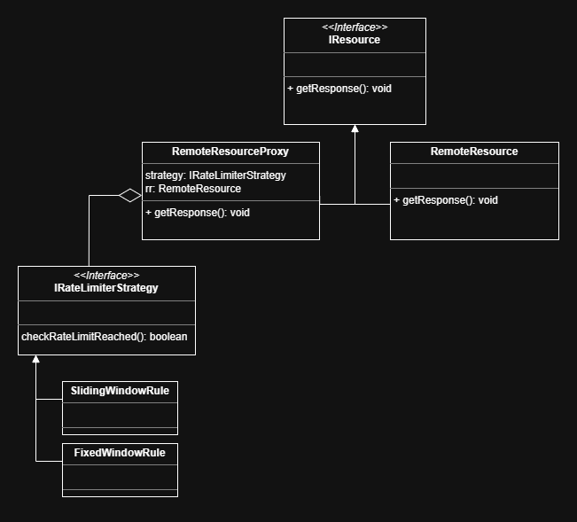

# Rate Limiting System

## UML Diagram

## Features

* Supports multiple rate limiting strategies:

  * Fixed Window Counter
  * Sliding Window (Sliding Log)
* Easily extensible to support:

  * Token Bucket
  * Leaky Bucket
* Clean separation using Strategy Pattern
* Proxy-based integration with external resource
* Thread-safe sliding window implementation

---

## Architecture

### Core Components

* `IRateLimiterStrategy`
  Defines the contract for rate limiting algorithms.

* `FixedWindowRule`
  Implements fixed window counter algorithm.

* `SlidingWindowRule`
  Implements sliding window log algorithm.

* `RemoteResourceProxy`
  Acts as a proxy to enforce rate limiting before calling the actual resource.

* `RemoteResource`
  Simulates the external paid API.

---

## How It Works

1. Client sends a request
2. Business logic determines if external call is needed
3. Proxy checks rate limit using configured strategy
4. If allowed → external API is called
   If denied → request is rejected with 429

---
